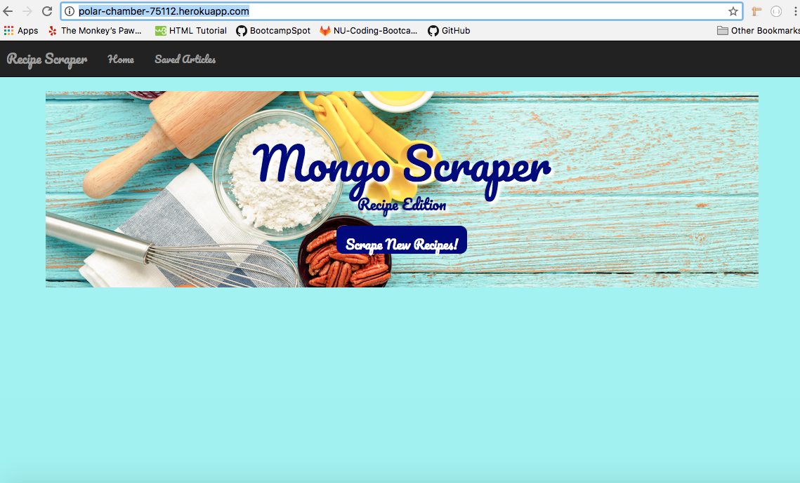
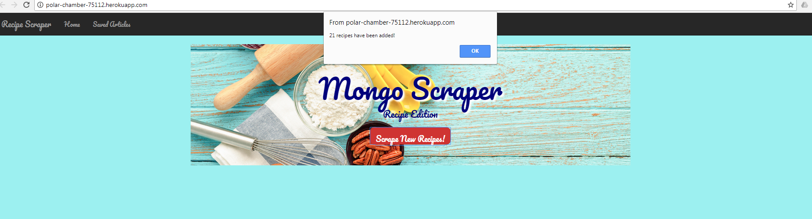
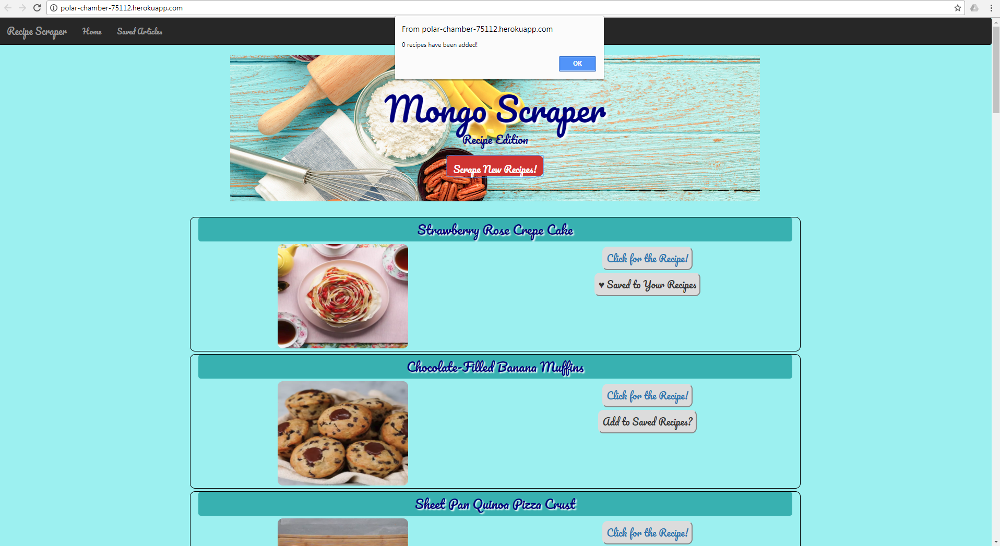
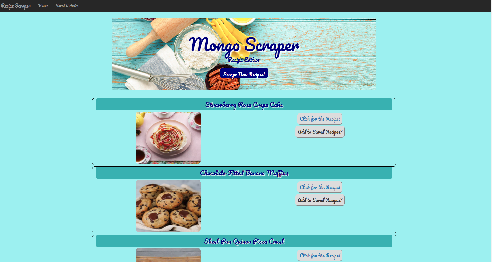
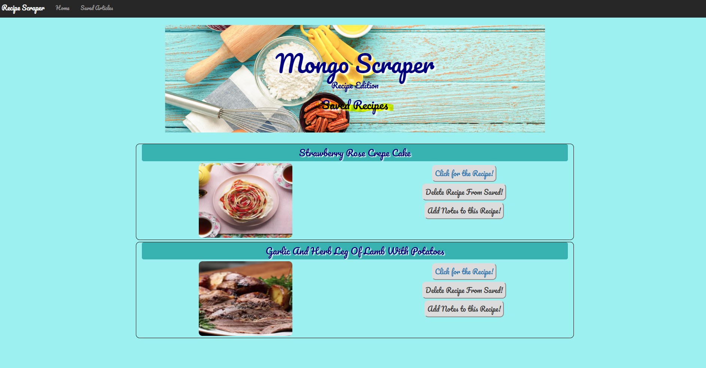
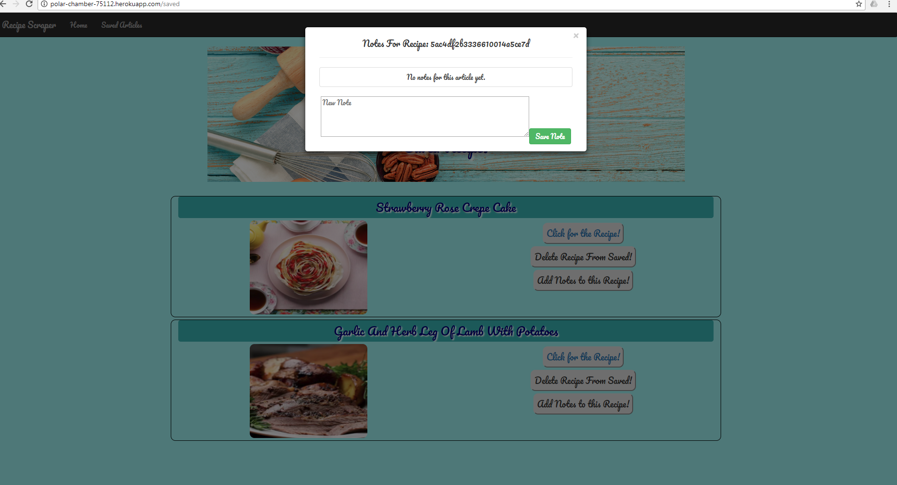
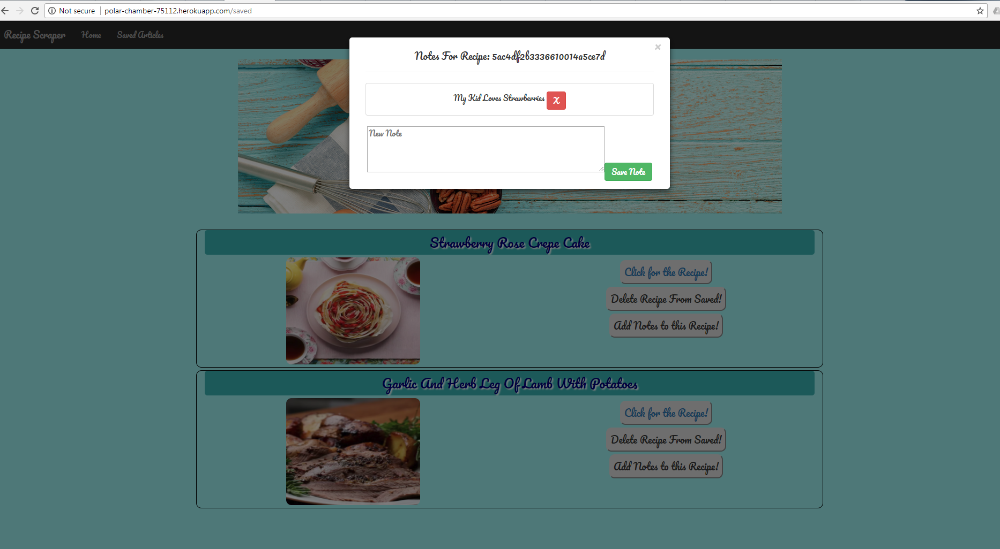

# MongoPractice

## Overview
A recipe scraper app using `Cheerio`, `Request`, `Mongo`, `Mongoose`, `Express`, `Body-Parser`, and `Handlebars.js` that lets users get up to date recipes from https://tasty.co/. 

## How it Works
* Find link [here] (http://polar-chamber-75112.herokuapp.com/)

> 

* Click `Scrape New Recipes` to Get New Recipes from https://tasty.co/.
* An alert will tell you how many items have been scraped. 

> 

  * If scrape is up to date, an alert will tell you that 0 recipes have been added.
  
  > 
  
* Recipes will display upon closing alert. 

> 

* Click on `Add to Saved Recipes?` button to add a recipe to your Saved Recipes. 
    * If user changes their mind about a recipe or misclicks, can click `Saved to Your Recipes` button to remove from your Saved Recipes.

> 

* To view  Saved Recipes, click on `Saved Articles` on navigation bar, which will lead to a page with a list of saved recipes. 

> 

* For each Saved Recipe: 
  * you can `Delete Recipe From Saved!` which  deletes recipe from your Saved Recipes Page.
  * you can `Click for the Recipe!` which opens a new tab for the Recipe. 
  * you can also `Add Notes to this Recipe!` which opens a modal popup of existing notes for the recipe.  
  
  > 
  > 
    

    
